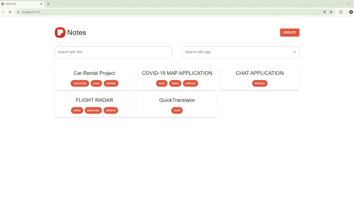

# 🚀 Note-Taking App with React & TypeScript

# 🛠️ Tech Stack:
React with TypeScript for type-safe development
Redux Toolkit for efficient state management
Material UI for a polished, responsive interface (my first time implementing it!)
React Router for seamless navigation
Redux Persist for data persistence (first-time implementation)

# ✨ Key Features:
Create, edit, and delete notes with Markdown support (react-markdown library)
Tag-based organization system with custom tag creation
Powerful filtering and search capabilities
Responsive design for all devices
Clean, intuitive user interface

# 💥 In this project, 
I particularly enjoyed exploring Material UI's component library for the first time. It significantly accelerated the development process of my project. Additionally, implementing Redux Persist was a valuable learning experience that allowed me to maintain user data between sessions without a backend.

# Preview of the Project

